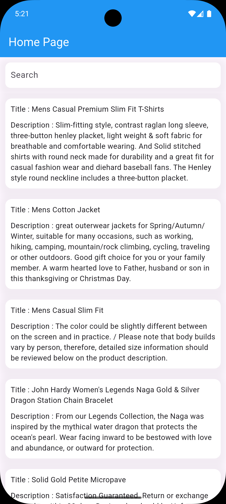

# 📱 assignment_01 – Flutter API Search App

This is a Flutter application demonstrating API data fetching using **Clean Architecture** and the **BLoC pattern** for state management. It fetches posts from the JSONPlaceholder API and includes real-time search, recent search history, pull-to-refresh, and loaders.

---

## 📄 Features

- ✅ **Fetches posts** from [JSONPlaceholder API](https://fakestoreapi.com/products)
- 🔍 **Real-time search bar** for filtering posts by title or content
- 🕓 **Recent search history** maintained and displayed in a horizontally scrollable list
- 🔄 **Pull-to-refresh** functionality for reloading the posts list
- ⏳ **Loading indicator** while fetching data
- 📱 Responsive UI optimized for various screen sizes

---

## 🛠️ Tech Stack

- Flutter
- Dart
- BLoC (`flutter_bloc`)
- HTTP Package
- Clean Architecture Principles
- Responsive UI with `flutter_screenutil`

---

## 📦 API Used

**URL:** [https://jsonplaceholder.typicode.com/posts](https://jsonplaceholder.typicode.com/posts)  
This public REST API returns a list of dummy posts in the following format:

```json
[
  {
    "userId": 1,
    "id": 1,
    "title": "sunt aut facere repellat provident occaecati excepturi optio reprehenderit",
    "body": "quia et suscipit..."
  }
]
```

## 📸 Screenshots

| Home Page                                                                                          |
| -------------------------------------------------------------------------------------------------- |
|  |

---

## 🚀 Getting Started

1. Clone the repository

```bash
git clone https://github.com/aviekhande/assignment_api_fetch
cd assignment_api_fetch
```

2. Install dependencies

flutter pub get 3. Run the app

flutter run

## 🔍 How Search & History Works

The search bar updates the results in real-time as you type.

Each non-empty search query is saved to recent searches.

The recent searches are shown as horizontal chips which can be tapped to re-trigger the search.

The list refreshes automatically with pull-to-refresh gesture.

## 👤 Author

Avinash Ekhande
💼 Flutter Developer
